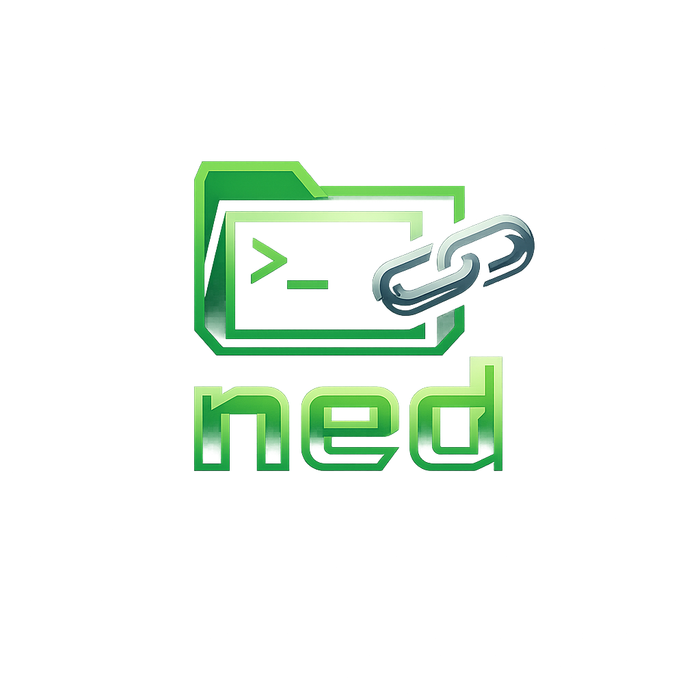

# ned

[](https://github.com/ValeryCherneykin/ned/actions/workflows/ci.yml)
[](https://goreportcard.com/report/github.com/ValeryCherneykin/ned)




----

ned is a CLI tool that lets you open any remote file in your local editor — with a single command.

It connects over SSH or Docker, downloads the file to your machine,
opens it in your local editor (Neovim, Vim, VSCode, etc.),
and uploads it back after you save and exit.

No installing editors on tiny VPS instances.  
No fighting with `vi` on production.  
No unnecessary setup.

```bash
ned root@192.168.1.10:/etc/nginx/nginx.conf
````

Works over SSH. Works with Docker containers. Zero setup required.

---

## Install

### Homebrew (macOS & Linux)

```bash
brew tap ValeryCherneykin/ned
brew install ned
```

### Go

```bash
go install github.com/ValeryCherneykin/ned/cmd/ned@latest
```

### Binary

Download the latest release:

[https://github.com/ValeryCherneykin/ned/releases/latest](https://github.com/ValeryCherneykin/ned/releases/latest)

---

## Usage

```
ned [flags] [user@]host[:port]:/remote/path
ned [flags] docker://container:/remote/path
```

### SSH

```bash
# Basic
ned root@192.168.1.10:/etc/nginx/nginx.conf

# Custom port
ned root@192.168.1.10:2222:/etc/.env

# Explicit SSH key
ned -i ~/.ssh/prod_key deploy@prod.example.com:/app/.env
```

### Docker

```bash
# Edit a file inside a running container
ned docker://my-container:/app/config.json
ned docker://postgres:/etc/postgresql/postgresql.conf
```

### Aliases (via config)

```bash
ned prod:/etc/.env
ned dev:/app/config.yml
ned staging:/var/log/app.log
```

---

## First connection

On the first password-based SSH connection, ned can automatically install
an SSH key for passwordless access:

```
→ connecting root@192.168.1.10:22
root@192.168.1.10's password: ••••••••
→ connected
No SSH key found for 192.168.1.10. Install one for passwordless access? [Y/n]: y
✓ generated new SSH key: ~/.ssh/ned_id_ed25519
✓ SSH key installed — next connect will be passwordless
```

After that, connections are instant.

---

## Config file

Create `~/.ned/config.yml`:

```yaml
defaults:
  user: valery
  port: 22
  identity: ~/.ssh/ned_id_ed25519

hosts:
  prod:
    host: 192.168.1.10
    user: deploy
    identity: ~/.ssh/prod_key
  dev:
    host: 10.0.0.5
    user: root
  staging:
    host: staging.example.com
    port: 2222
    user: ubuntu
```

Then:

```bash
ned prod:/etc/nginx/nginx.conf
```

---

## Flags

| Flag        | Description                                |
| ----------- | ------------------------------------------ |
| `-i <path>` | Path to SSH private key                    |
| `-p <port>` | SSH port (overrides config and default 22) |
| `--version` | Print version and exit                     |

---

## Recovery

If upload fails (network drop, restart, etc.), your changes are saved locally:

```
~/.ned/recovery/.env_20260304_153042
```

Fix the connection and re-run ned — your edits are safe.

---

## How it works

```
ned root@host:/etc/.env
      │
      ├── Parse target
      ├── Connect via SSH / Docker
      ├── Download file
      ├── Open in $EDITOR
      ├── Wait for exit
      ├── Upload back
      └── Cleanup
```

Signals are handled gracefully to prevent data loss.

---

## Editor behavior

ned respects the `$EDITOR` environment variable.

If not set, it tries:

```
nvim → vim → nano → vi
```

You can override per session:

```bash
EDITOR=hx ned root@host:/etc/.env
```

---

## Architecture

```
ned/
├── cmd/ned/          # entry point
└── internal/
    ├── auth/         # SSH auth chain
    ├── backend/      # SSH + Docker implementations
    ├── config/       # config loader + alias resolver
    ├── connection/   # SSH + SFTP lifecycle
    ├── editor/       # $EDITOR resolution + exec
    ├── keygen/       # ed25519 key generation
    ├── recovery/     # local backup on failure
    ├── target/       # CLI argument parser
    ├── terminal/     # user I/O
    └── transfer/     # download/upload logic
```

---

## Contributing

```bash
git clone https://github.com/ValeryCherneykin/ned
cd ned

task test
task lint
task check
```

Pull requests are welcome.

---

## License

MIT © Valery Cherneykin
